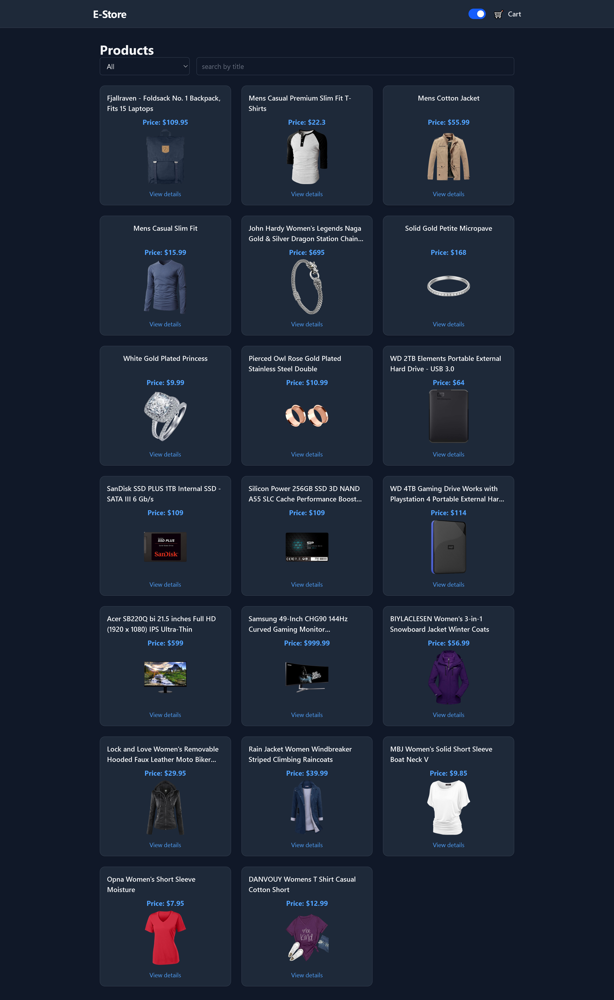
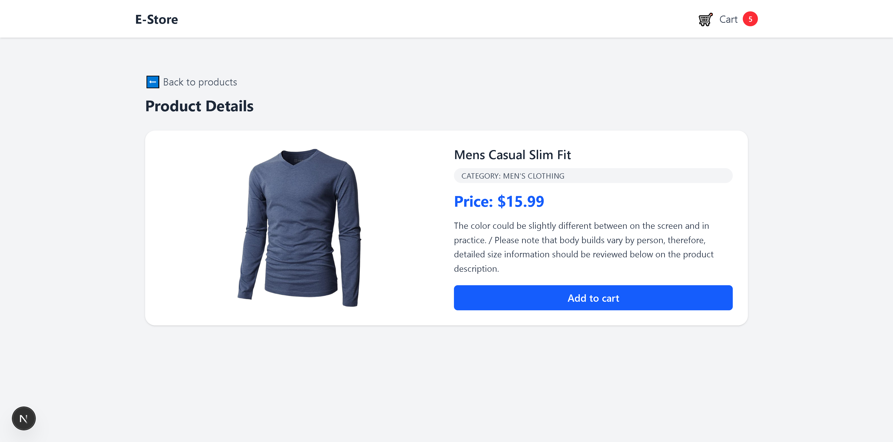
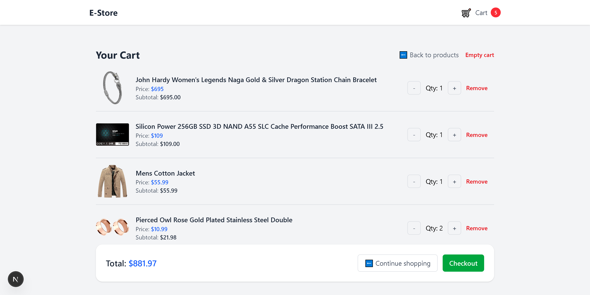

# 🛒 E-Commerce Frontend — Next.js App Router

A **production-grade, fully responsive e-commerce frontend** built with **Next.js (App Router)**, **React**, **TypeScript**, **Redux Toolkit**, and **Tailwind CSS**.

The application consumes products from **FakeStoreAPI** and implements a complete real-world e-commerce flow including:

- Authentication system (Sign up / Sign in / Profile)
- Protected routes
- Fully validated checkout system
- API Route simulation
- Persistent order history per user
- Centralized state management using Redux Toolkit
- Clean architecture with separation of concerns
- Dark / Light mode support
- Unit & integration testing

This project reflects real-world frontend architecture patterns and production-level engineering practices.

---

## 🚀 Features

### 🛍️ Product Listing
- Fetch products from **FakeStoreAPI**
- Responsive product grid layout
- Search by product title
- Category filtering
- Loading, error, and empty states
- Clean UI built with **Tailwind CSS**

### 📄 Product Details
- Dynamic routing using `/products/[id]`
- Product image, price, description & category
- Add to cart functionality
- Data fetching isolated in a custom hook

### 🔐 Authentication System
- Client-side authentication simulation
- Sign up & Sign in forms with validation
- Confirm password validation
- Editable profile page
- Protected routes using a custom `<ProtectedRoute />` component
- Global auth state managed with Redux Toolkit

### 💳 Checkout System
- Shipping form with field-level validation
- Payment method selection (Card / Bank Transfer)
- Modular validation architecture
- Centralized order validation before submission
- Terms & Conditions acceptance requirement
- API Route simulation using Next.js App Router

### 📦 Order History
- Orders persisted in `localStorage`
- User-based order filtering
- Dedicated “My Orders” page
- Dynamic success page with generated order ID

### 🛒 Shopping Cart (Redux Toolkit)
- Global cart state using Redux Toolkit (Single Source of Truth)
- Add / remove items
- Increase / decrease quantity
- Clear entire cart
- Auto-calculated subtotal & total
- Cart indicator synced globally in the header
- Persisted state using `localStorage`

### 🌗 Dark / Light Mode
- Global theme toggle
- Persisted user preference using `localStorage`
- Implemented safely to avoid Next.js hydration issues
- Client-only interactive header to prevent SSR mismatch

### 🧪 Testing
- Unit tests for Redux cart slice
- Integration tests for Cart page UI & interactions
- Jest + React Testing Library setup

---

## 🧠 Architecture & Technical Decisions

### 🔄 Server / Client Rendering & Hydration

During implementation of dark mode and global header state, a hydration mismatch issue appeared due to theme-dependent styles in the root layout.

To solve this:

- The interactive `Header` was moved into a **client-only component**
- This avoided SSR hydration mismatches
- Allowed safe theme switching and cart state updates
- Improved separation between server and client responsibilities

This reflects a real-world understanding of:

- Next.js App Router rendering model
- Server vs Client Components
- React hydration behavior

---

### 🧱 State Management & Business Logic Separation

All cart business logic is centralized inside:

```txt
/store-redux
├── cartSlice.ts
├── cartSlice.test.ts
└── index.ts
```

Benefits:
- UI components stay focused on rendering
- Business rules live in one place
- Predictable state updates
- Easier testing and scaling
- Ready to replace localStorage with a backend API in the future

### 🛍 Checkout & Order Flow Architecture

Checkout flow is modularized into:

```txt
/components/checkout  
├── ShippingForm.tsx  
├── PaymentMethod.tsx  
└── OrderSummary.tsx  
```

Validation logic is separated inside:

```txt
/utils/checkout  
├── shippingValidation.ts  
├── paymentValidation.ts  
└── orderValidation.ts
```

Orders are persisted per user using localStorage and filtered dynamically inside the Orders page.

This structure allows easy migration to a real backend in the future.

---

### 🌐 Data Access Layer

All API communication is isolated in:
```
/services
└── products.service.ts
```

And consumed through:
```
/hooks
├── useProducts.ts
└── useProductDetails.ts
```

This provides:
- Clean separation of concerns
- Reusable and testable data logic
- Cleaner page components


---

## 🗂 Project Structure
```
app/
├── api/
│   └── order/
│       └── route.ts                    # Order API simulation
│
├── auth/
│   └── page.tsx
│
├── cart/
│   ├── CartItemRow.tsx
│   ├── CartPage.test.tsx
│   └── page.tsx
│
├── checkout/
│   └── page.tsx
│
├── order-success/
│   └── page.tsx
│
├── orders/
│   └── page.tsx
│
├── products/
│   ├── page.tsx                        # Products listing (Server Component)
│   ├── ProductsClient.tsx
│   ├── ProductCard.tsx
│   ├── loading.tsx                     # Route-level loading boundary
│   ├── error.tsx                       # Route-level error boundary
│   └── [id]/
│       ├── page.tsx                    # Dynamic product details
│       ├── ProductDetailsClient.tsx
│       └── not-found.tsx               # 404 handling
│
├── profile/
│   └── page.tsx
│
├── layout.tsx
├── page.tsx
├── globals.css
└── favicon.ico


components/
├── Header.tsx
├── auth/
│   └── ProtectedRoute.tsx
├── checkout/
│   ├── ShippingForm.tsx
│   ├── PaymentMethod.tsx
│   └── OrderSummary.tsx
└── ui/
    ├── EmptyState.tsx
    └── ErrorState.tsx


services/
├── products.service.ts
└── order.service.ts


store-redux/
├── authSlice.ts
├── cartSlice.ts
├── cartSlice.test.ts
├── checkoutSlice.ts
└── index.ts


types/
├── product.ts
├── cart-item.ts
└── order.ts


utils/
└── checkout/
    ├── shippingValidation.ts
    ├── paymentValidation.ts
    └── orderValidation.ts

```

---

## 🛠 Tech Stack

- **Next.js (App Router)**
- **React**
- **TypeScript**
- **Redux Toolkit**
- **Tailwind CSS**
- **Jest & React Testing Library**
- **FakeStoreAPI**
- **Vercel**


---

## 📸 Screenshots

### 🏠 Home Page  


### 🌗 Home Page (Dark Mode)  


### 📦 Product Details  


### 🧺 Cart Page  


### ❌ Empty Cart  


---

## ▶️ Run Locally

```bash
git clone https://github.com/ahmadashraf7x/ecommerce-nextjs-tailwind.git
cd ecommerce-nextjs-tailwind
npm install
npm run dev
```

## 🌍 Live Demo

🚀 https://ecommerce-nextjs-tailwind-ecru.vercel.app


---

### 📌 Author
**Ahmad Ashraf**

Front-End Developer