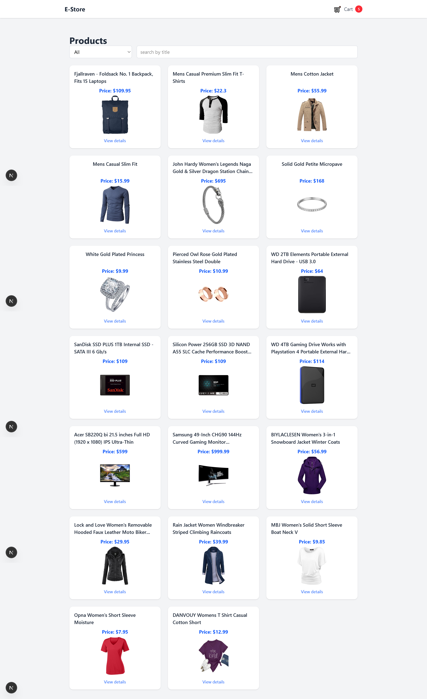

# 🛒 E-Store — Modern E-Commerce Frontend

A fully responsive e-commerce frontend built with **Next.js 16**, **React**, **TypeScript**, and **Tailwind CSS**.  
Fetches products from **FakeStoreAPI**, supports search, filtering, dynamic routing, full cart management, and persistent storage using `localStorage`.

---

## 🚀 Features

### 🛍️ Product Listing
- Fetch products from **FakeStoreAPI**
- Responsive product grid layout
- Search by product title
- Category filtering
- Modern clean UI using **Tailwind CSS**

### 📄 Product Details
- Dynamic routing using `/[id]`
- Product image, price, description & category
- Add to cart button
- Saved to cart inside localStorage

### 🛒 Shopping Cart
- View all cart items
- Increase / decrease item quantity
- Remove individual items
- Empty cart completely
- Auto-calculated **subtotal & total**
- Cart synced with navbar using a custom `cart-updated` event
- Cart data stored in **localStorage**

### 🧭 Global Navbar (Layout)
- Shared across all pages (Next.js App Router)
- Live cart counter updates instantly
- Clean and reusable layout structure

---

## 🛠 Tech Stack
- **Next.js v16.0.5**
- **React**
- **TypeScript**
- **Tailwind CSS**
- **LocalStorage API**
- **FakeStoreAPI**

---

## 📸 Screenshots

### 🏠 Home Page  


### 📦 Product Details  


### 🧺 Cart Page  


### ❌ Empty Cart  


---

## ▶️ Run Locally

```bash
git clone https://github.com/ahmadashraf7x/ecommerce-nextjs-tailwind.git
cd ecommerce-nextjs-tailwind
npm install
npm run dev
```

🌍 Live Demo 
(Coming Soon)
Will be deployed on Vercel.

---

### 📌 Author
**Ahmad Ashraf**

Front-End Developer